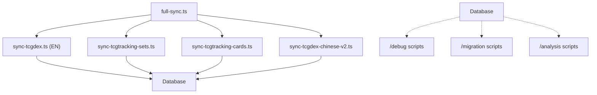

# Scripts Directory Structure

**Guía de organización de scripts CLI para ProyectoDJCards2**

---

## 📁 Organización

```
scripts/
├── 📄 ACTIVE SYNC SCRIPTS (en raíz)
├── 📁 debug/           # Debugging & troubleshooting
├── 📁 migration/       # Database & data operations
├── 📁 analysis/        # Data analysis & reporting
└── 📄 Other utilities
```

---

## 🔄 ACTIVE SYNC SCRIPTS (Raíz - `/scripts/`)

**Usar estos scripts regularmente:**

### Core Sync Scripts
| File | Purpose | Command |
|------|---------|---------|
| `sync-tcgdex.ts` | Multi-language sync (EN, JA, etc) | `npm run sync:english` |
| `sync-tcgdex-chinese-v2.ts` | Chinese sync (optimized v2) | `npm run sync:chinese` |
| `sync-tcgtracking-sets.ts` | Japanese sets (TCGTracking) | `npm run sync:tcgtracking:sets` |
| `sync-tcgtracking-cards.ts` | Japanese cards (TCGTracking) | `npm run sync:tcgtracking:cards` |
| `sync-set.ts` | Single set sync (debug) | `npm run sync:set <id>` |
| `full-sync.ts` | Orchestrated full sync | `npm run sync:full` |

### Utility Scripts
| File | Purpose |
|------|---------|
| `create-set-language-mappings.ts` | Create language mappings between APIs |
| `fetch-japanese-data.sh` | Bash helper for Japanese data |
| `insert-japanese.sh` | Bash helper for Japanese inserts |
| `scrape-m2a-tcgcollector.ts` | M2A product scraping |
| `sync-single-set.ts` | Debug: sync single set (M4 example) |

---

## 🔧 DEBUG SCRIPTS (`/scripts/debug/`)

**Troubleshooting & diagnostic tools**

| File | Purpose |
|------|---------|
| `check-card-sync-status.ts` | Check which cards are synced |
| `check-external-refs.ts` | Verify ID mappings between APIs |
| `check-logos.ts` | Check image/logo URLs |
| `check-set-images.ts` | Verify set images are accessible |
| `debug-chinese-structure.ts` | Inspect Chinese data structure |
| `debug-logo-sources.ts` | Debug logo fetching logic |
| `debug-tcgtracking-api.ts` | Test TCGTracking API connection |
| `investigate-chinese-cards.ts` | Analyze Chinese card data |
| `investigate-chinese-sets.ts` | Analyze Chinese set data |

**Example Usage:**
```bash
ts-node scripts/debug/check-external-refs.ts
ts-node scripts/debug/debug-tcgtracking-api.ts
```

---

## 📊 MIGRATION SCRIPTS (`/scripts/migration/`)

**Database & data operations**

| File | Purpose |
|------|---------|
| `migrate.ts` | Run SQL migrations (normal npm script) |
| `fix-corrupted-refs.ts` | Fix broken external references |
| `load-m2a-complete.ts` | Load M2A set (complete) |
| `load-m2a-manual.ts` | Load M2A set (manual) |
| `backfill-m2a-images.ts` | Fill missing M2A images |
| `update-tcgtracking-images.ts` | Update TCGTracking images |
| `update-tcgtracking-logos-v2.ts` | Update logos (v2 optimized) |
| `clean-tcgtracking.ts` | Clean TCGTracking data |
| `*.sql` | SQL migration files |
| `insert-japanese-sets.sql` | SQL: Insert Japanese sets |
| `monitor-tcgtracking-progress.sql` | SQL: Monitor sync progress |

**Example Usage:**
```bash
npm run migrate                               # Normal migrations
ts-node scripts/migration/fix-corrupted-refs.ts  # Fix data
ts-node scripts/migration/load-m2a-complete.ts   # Load M2A set
```

---

## 🔍 ANALYSIS SCRIPTS (`/scripts/analysis/`)

**Data analysis & reporting**

| File | Purpose |
|------|---------|
| `analyze-pokemontcg-logos.ts` | Analyze Pokemon TCG logo status |
| `analyze-tcgtracking-images.ts` | Analyze TCGTracking image coverage |
| `research-logo-sources.ts` | Research where logos come from |

**Example Usage:**
```bash
ts-node scripts/analysis/analyze-pokemontcg-logos.ts
ts-node scripts/analysis/analyze-tcgtracking-images.ts
```

---

## 🎯 Common Tasks

### Full Data Sync
```bash
npm run sync:full
# Syncs: English → Japanese → Chinese (takes ~15 minutes)
```

### Sync Individual Languages
```bash
npm run sync:english      # EN only
npm run sync:japanese     # JA only (both sets + cards)
npm run sync:chinese      # ZH only
```

### Debug Connection Issues
```bash
ts-node scripts/debug/debug-tcgtracking-api.ts
ts-node scripts/debug/check-external-refs.ts
```

### Database Maintenance
```bash
npm run migrate                           # Run migrations
ts-node scripts/migration/fix-corrupted-refs.ts  # Fix data integrity
```

---

## ✅ Best Practices

1. **Never run directory scripts directly** - Always use `npm run` commands
2. **Check migrations before running** - Backup database first
3. **Monitor logs** - Use `docker-compose logs -f` during sync
4. **Debug systematically**:
   - Check database connection: `/debug/debug-tcgtracking-api.ts`
   - Check data integrity: `/debug/check-external-refs.ts`
   - Check images: `/debug/check-logos.ts`

---

## 📝 Script Dependencies



---

## 🚀 Deployment Notes

- **Render:** No ejecutar scripts directamente. Usar Background Jobs o API endpoints.
- **Docker:** Scripts se ejecutan dentro del container si existe.
- **Production:** Migrar `/debug/` y `/analysis/` a carpeta no-committed si es necesario.

---

**Last Updated:** April 11, 2026
